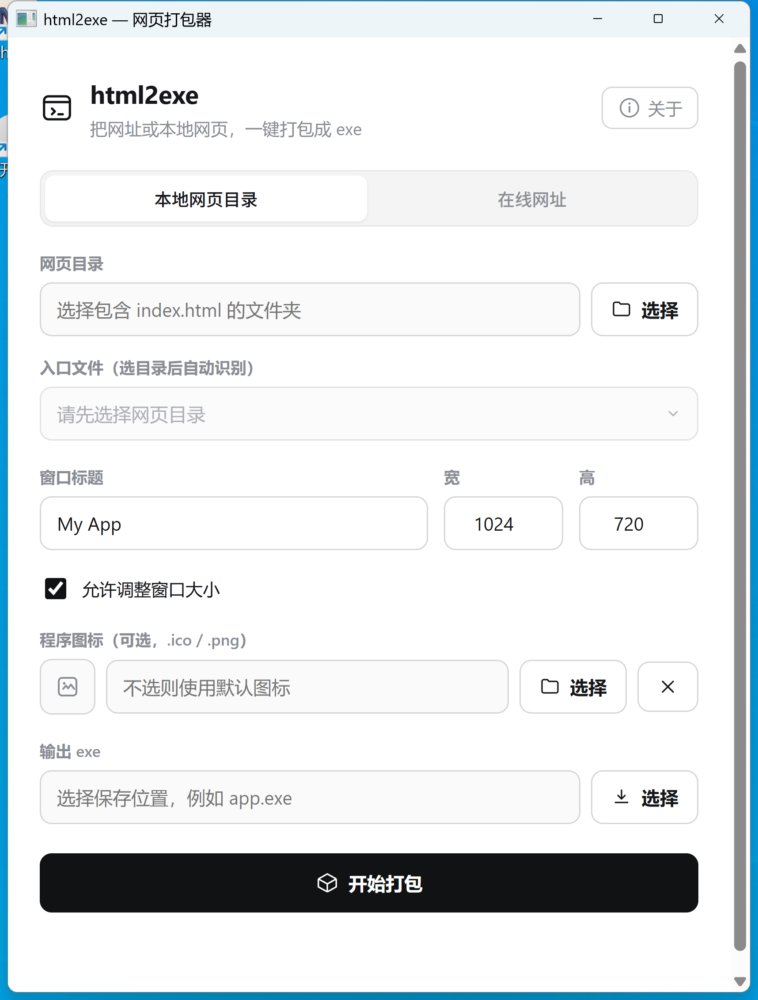

# Exeify

**把网址或本地 HTML 项目，一键打包成可运行的 Windows `.exe`。**

给小白用的图形界面工具：选一个在线网址、或一个本地网页文件夹，点一下就得到一个双击即开的 `.exe`。
生成的程序使用 Windows 自带的 WebView2 显示，**体积不到 1 MB**，终端用户无需安装任何东西。

<p align="center">
  
</p>

## 特点

- **极致轻量**：打包器和产物都不到 1 MB（对比 Electron ~100 MB、Pake ~10 MB）。
- **秒级出包**：不编译、不联网。选好点一下，一秒钟生成 exe。
- **零工具链**：使用者不用装 Rust / Node；产物在别人电脑上也只依赖系统自带的 WebView2（Win10/11 通常已内置）。
- **双模式**：**在线网址** 和 **本地网页目录** 都支持，本地项目完全离线自包含。
- **自动识别入口**：选好本地目录，自动扫描出网页入口（优先 `index.html`），多个可下拉切换，不用手打路径。
- **自定义图标**：可给产物 exe 换成自己的 `.png` / `.ico`（自动转换、生成多分辨率），支持索引色等各类 PNG。
- **图形界面**：现代极简白，专为不懂命令行的人设计。

## 使用方法（图形界面）

1. 下载并运行 `exeify.exe`。
2. 选择模式：
   - **本地网页目录** —— 选一个包含网页的文件夹；**入口文件会自动识别**（多个时可下拉切换）。
   - **在线网址** —— 填一个 `https://` 开头的网址。
3. 填窗口标题、宽高，勾选是否允许调整窗口大小。
4. *(可选)* 选一个 `.png` / `.ico` 作为产物的**程序图标**（不选则用默认图标）。
5. 选择输出位置（`xxx.exe`），点 **开始打包**。
6. 双击生成的 exe 即可运行。

> 点击右上角「关于」可查看作者信息与公众号。

## 相对 Pake 的差异

| | Pake | **Exeify** |
|---|---|---|
| 打包时要装的东西 | Node.js + Rust + Tauri 工具链 | **无，下载即用** |
| 打包耗时 | 分钟级（真的在编译） | **秒级（不编译，直接生成）** |
| 本地目录 | 支持，但要走完整编译 | **一等公民，秒出** |
| 面向人群 | 开发者 / 命令行 | **小白 / 图形界面** |

> Pake 很棒，主打把在线网址做成精致桌面 App；Exeify 主打 **零门槛、秒出包、本地与网址双支持**。

## 命令行（可选，进阶）

同一个 exe 也内置了隐藏 CLI，方便脚本化：

```bash
exeify pack-local <网页目录> <输出.exe> [入口=index.html] [图标.ico/.png]
exeify pack-url   <网址>     <输出.exe> [图标.ico/.png]
```

## 技术栈

- [wry](https://github.com/tauri-apps/wry) + [tao](https://github.com/tauri-apps/tao) —— 系统 WebView2
- Rust，`zip`（资源打包）/ `rfd`（原生对话框）/ `serde`
- `editpe` + `ico` + `png`（产物图标写入 / PNG→ICO）/ `winresource`（打包器自身图标）

## 从源码构建

需要 Rust（`x86_64-pc-windows-msvc`）：

```bash
cargo build --release
# 产物：target/release/exeify.exe
```

## 运行环境

- Windows 10 / 11
- [WebView2 运行时](https://developer.microsoft.com/microsoft-edge/webview2/)（Win11 及较新 Win10 已内置）

## 许可证与二开须知

本项目基于 **[Apache License 2.0](LICENSE)** 开源，Copyright 2026 **不坑老师**。

欢迎二次开发（改造、集成、商用均可），但按 Apache-2.0 的要求，**再分发 / 二开时必须**：

1. 保留 [`LICENSE`](LICENSE) 与 [`NOTICE`](NOTICE) 文件（`NOTICE` 里包含对「不坑老师」的署名，必须原样带上）；
2. 保留源码文件顶部的版权声明；
3. 若你修改了代码，需注明改动。

> 说明：Apache-2.0 要求的是在**源码 / 分发物 / NOTICE** 中保留署名，并不强制在你的成品界面里展示；
> 也允许闭源与商用，只要满足上述署名义务。若你愿意在 App 里保留"关于"页对「不坑老师」的展示，我们非常欢迎 🙏。
